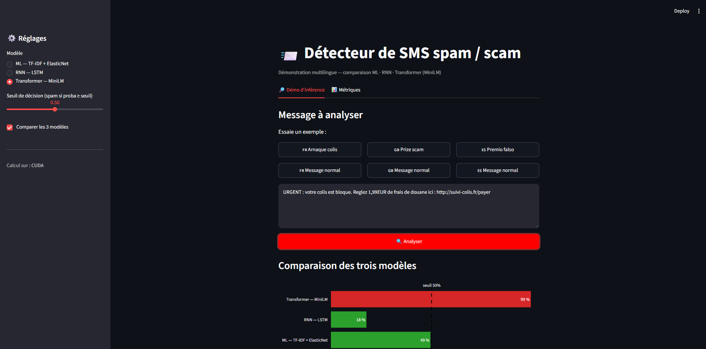
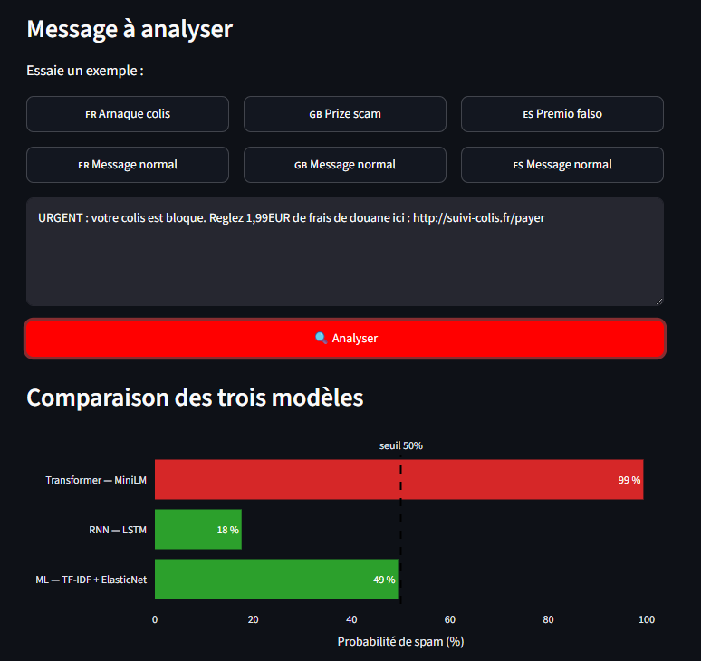
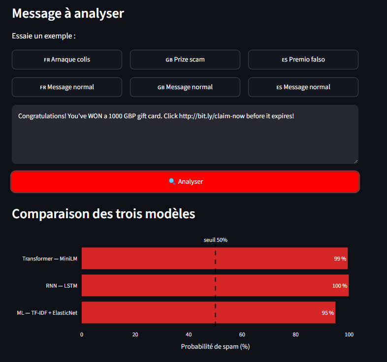

# Cours Deep Learning M2 — Détecteur de SMS spam / scam

Etudiant : Amaury TISSOT
Classe : DIS MIA 26.2

Projet de classification de SMS spam / scam comparant trois approches — machine
learning classique, RNN et Transformer : le tout exposé via un dashboard interactif.

## Résumé du notebook

Le notebook `notebooks/01-at-sms-spam.ipynb` déroule la démarche complète, en deux temps :

**1. Premier dataset (SMS Spam Collection, anglais)**

- **Dataset** : https://www.kaggle.com/datasets/uciml/sms-spam-collection-dataset
- **Baseline machine learning** : vectorisation TF-IDF + régression logistique
  **ElasticNet**. Rapide, interprétable, elle fixe le niveau de référence à battre.
- **RNN** : `Embedding → LSTM → mean-pooling masqué → Dense`, entraîné en PyTorch.

**2. Second dataset, plus volumineux et multilingue**

- **Dataset** : https://github.com/vinit9638/SMS-scam-detection-dataset
- Ré-entrainement la baseline ML et le RNN sur ce nouveau corpus pour comparer.
- Transfer learning — Transformer MiniLM : fine-tuning d'un MiniLM multilingue
  pré-entraîné sur le texte brut (tokenisation en sous-mots). C'est l'approche qui
  généralise le mieux, notamment sur les langues sous-représentées.

Les trois modèles partagent le même découpage train/test, ce qui rend la comparaison
finale directement lisible. Le notebook se termine par l'export des modèles et des
métriques de test pour le dashboard.

## Difficulté rencontrée : du CPU TensorFlow au GPU PyTorch

La première implémentation du réseau de neurones utilisait TensorFlow en CPU.
L'entraînement était trop lent pour itérer confortablement sur les hyperparamètres.

J'ai donc basculé sur PyTorch avec accélération GPU (CUDA).

## Dashboard interactif (Streamlit)

Une application Streamlit (`app/streamlit_app.py`) permet de tester les trois
modèles en direct sur un message saisi, de comparer leurs probabilités de spam, et de
consulter un onglet "Métriques" (scores, matrices de confusion, courbes ROC).

### Présentation de l'application



On choisit le modèle et le seuil de décision dans la barre latérale, on saisit un
message (ou on clique un exemple), et le verdict s'affiche avec la comparaison des trois
modèles.

### Exemple — spam en français



Sur un SMS d'arnaque en français (« URGENT : votre colis est bloqué… »), seul le
Transformer MiniLM détecte le spam (99 %). Le RNN (18 %) et la baseline ML (49 %)
passent à côté : entraînés sur un vocabulaire plus limité, ils généralisent mal aux
tournures françaises.

### Exemple — spam en anglais



Sur un spam en anglais (« Congratulations! You've WON a 1000 GBP gift card… »), les
trois modèles détectent l'arnaque (MiniLM 99 %, RNN 100 %, ML 95 %) : c'est le cadre
sur lequel ils ont tous été le mieux entraînés.

## Prérequis

- Python 3.10

## Installation

```powershell
# Créer l'environnement virtuel
py -3.10 -m venv .venv

# Activer (PowerShell)
.venv\Scripts\Activate.ps1

# Installer les dépendances
python -m pip install --upgrade pip
python -m pip install -r requirements.txt
```

Pour le support GPU (NVIDIA), installer `torch` via l'index CUDA, p. ex. CUDA 12.4 :

```powershell
pip install torch --index-url https://download.pytorch.org/whl/cu124
```

## Lancer Jupyter

```powershell
.venv\Scripts\Activate.ps1
jupyter lab
```

Le notebook se trouve dans `notebooks/01-at-sms-spam.ipynb`.

## Lancer le dashboard

```powershell
# PowerShell
.venv\Scripts\Activate.ps1
streamlit run app/streamlit_app.py
```

```bash
# Bash (Git Bash / Linux / macOS)
source .venv/Scripts/activate   # Linux/macOS : source .venv/bin/activate
streamlit run app/streamlit_app.py
```

Le dashboard charge les modèles exportés depuis `artifacts/`. Exécuter au préalable les
dernières cellules du notebook pour générer ces artefacts (et `artifacts/metrics.json`
pour l'onglet Métriques).

## Outils

Ce projet a été développé avec l'assistance de **Claude Code** (Anthropic) comme outil
de pair-programming : aide à la structuration du code, au dashboard Streamlit et à la
rédaction de la documentation.
